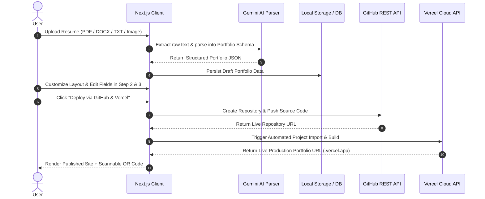

# 🚀 Portify AI — Production-Grade AI Portfolio Engine

<div align="center">


**[🌐 Live Demo](https://portfolio-maker-topaz.vercel.app/)** • **[👑 Premier Theme Demo](https://portfolio-one-mu-pkpm6lad9n.vercel.app/)** • **[📖 Documentation](#-system-architecture)**

</div>

---

## 📌 Executive Summary

**Portify AI** is an enterprise-ready, multi-modal AI portfolio generator that converts raw resumes (PDF, DOCX, TXT, PNG/JPG) into high-converting, fully dynamic developer portfolio websites in under **30 seconds**. 

Built with **Next.js 14 (App Router)**, **TypeScript**, **Google Gemini AI**, and **Tailwind CSS**, Portify AI features an interactive **4-Step Stepper UX Flow**, **61+ Theme Combinations** (including the **👑 Top 1 Premier Flagship Theme**), an interactive **Developer CLI Zsh Terminal**, an **Embedded AI Assistant**, real-time **Scannable QR Code Canvas**, **High-Res PDF Export**, and automated **GitHub → Vercel 1-Click Deployment Pipelines**.

---

## ✨ Flagship Features

| Feature | Description | Tech Stack |
| :--- | :--- | :--- |
| **🤖 Multi-Modal AI Resume Parser** | Parses PDF, DOCX, TXT, and scanned image resumes directly into structured JSON schemas. | `Gemini 1.5 Pro` / `PDF.js` / `Mammoth` |
| **👑 Top 1 Premier Theme** | Inspired by top 1% developer portfolios with Netflix Crimson accent glows, infinite marquee tickers, & custom Google typography. | `TailwindCSS` / `Caveat` / `Outfit` / `JetBrains Mono` |
| **💻 Interactive CLI Terminal** | Full zsh developer shell supporting `help`, `cat resume`, `skills`, `projects`, `experience`, `whoami`, `clear`. | `Custom React State Machine` |
| **💬 Embedded AI Assistant** | Instant chat drawer allowing recruiters to chat with an AI clone of the developer. | `Gemini AI API` |
| **🗺️ 4-Step Stepper Flow** | Guided UX pipeline: `(1) Upload ➔ (2) AI Review & Edit ➔ (3) Theme Customizer ➔ (4) Publish & Share`. | `React Context` / `Local Store` |
| **🚀 Automated GitHub + Vercel Deployment** | 1-Click repository creation on user's GitHub account and automated deployment to Vercel Cloud with token helpers & URL sanitizers. | `GitHub REST API v3` / `Vercel REST API v9` |
| **📱 Live Scannable QR Code** | Instant high-resolution QR code generator for print resumes & business cards with 1-click PNG download. | `QRServer API` / `HTML Canvas` |
| **📄 1-Click PDF Exporter** | Print-ready CSS media query stylesheets for high-resolution PDF downloads. | `CSS @media print` |

---

## 🏗️ System Architecture



---

## 🛠️ Technology Stack

```
├─ Core Framework     : Next.js 14.2 (App Router, Server Actions, API Routes)
├─ Language           : TypeScript 5.0 (Strict Mode, 0 Errors)
├─ UI & Styling       : Tailwind CSS, Lucide Icons, Framer Motion
├─ AI Infrastructure  : Google Gemini 1.5 Pro AI SDK
├─ Deployment APIs    : Octokit / GitHub REST API v3, Vercel REST API v9
├─ Data Parsing       : PDF.js, Mammoth.js (DOCX), Tesseract OCR
└─ Storage & Auth     : LocalStorage / Supabase PostgreSQL (Optional)
```

---

## ⚡ Quick Start & Local Setup

### Prerequisites
* **Node.js**: `v18.17.0` or higher
* **Package Manager**: `npm` / `pnpm` / `yarn` / `bun`

### 1. Clone Repository
```bash
git clone https://github.com/satyamapoorva06-blip/portfolio-maker.git
cd portfolio-maker
```

### 2. Install Dependencies
```bash
npm install
```

### 3. Configure Environment Variables
Copy `.env.example` to `.env.local`:
```bash
cp .env.example .env.local
```

Populate `.env.local` with your API keys:
```env
# Google Gemini AI Key (Required for AI Resume Parsing & Chat)
GEMINI_API_KEY=your_gemini_api_key_here

# App URL
NEXT_PUBLIC_APP_URL=http://localhost:3000
```

### 4. Run Development Server
```bash
npm run dev
```
Open [http://localhost:3000](http://localhost:3000) in your browser.

---

## 📂 Directory Structure

```
portfolio-maker/
├── app/                        # Next.js 14 App Router Routes
│   ├── api/                    # Serverless API Endpoints
│   │   ├── ai/improve/         # AI Text Improver API
│   │   ├── github/create-repo/ # GitHub Repo Creation API
│   │   ├── resume/parse/       # Multi-modal Resume Parser API
│   │   └── vercel/deploy/      # Vercel Deployment Trigger API
│   ├── customize/              # Step 3: Theme Customizer Wrapper
│   ├── dashboard/              # User Portfolio Management Dashboard
│   ├── editor/[id]/            # Split-Screen Live Editor Workspace
│   ├── parse/                  # Step 2: AI Extraction Review Drawer
│   ├── publish/                # Step 4: Dedicated Live URL & QR Code Page
│   ├── u/[username]/           # Dynamic Public Portfolio Viewer Route
│   └── upload/                 # Step 1: Resume Upload Page
├── components/                 # Reusable UI & Layout Components
│   ├── editor/                 # Live Preview Frames & Controls
│   ├── landing/                # Hero, Navbar, Footer, Features
│   └── navigation/             # Persistent 4-Step Progress Stepper Bar
├── lib/                        # Utility Functions & Storage Engines
│   ├── ai/                     # Gemini AI Prompts & Parsers
│   ├── github/                 # GitHub REST API Wrappers
│   ├── storage/                # Type-Safe Local Storage Client
│   └── vercel/                 # Vercel REST API Client
├── templates/                  # Portfolio Theme Renderers (61+ Combos)
│   ├── top1-premier/           # 👑 Top 1 Premier Flagship Theme
│   ├── modern-minimalist/      # Clean Minimalist Theme
│   ├── developer-dark/         # Classic Developer Dark Theme
│   └── obsidian-glitch/        # High-Tech Cyberpunk Theme
├── types/                      # TypeScript Definitions & Interfaces
└── public/                     # Static Assets, Icons, and Fonts
```

---

## 📡 API Endpoint Reference

### `POST /api/resume/parse`
Parses uploaded resume files into structured JSON.
* **Content-Type**: `multipart/form-data`
* **Body**: `file` (PDF, DOCX, TXT, PNG)
* **Response**: `PortfolioData` object

### `POST /api/github/create-repo`
Creates a public repository on the user's GitHub account and commits portfolio source files.
* **Body**: `{ repoName, githubUsername, token, portfolio }`
* **Response**: `{ success: true, repoUrl: string, fullName: string }`

### `POST /api/vercel/deploy`
Imports the created GitHub repository directly into Vercel for 1-Click live deployment.
* **Body**: `{ repoFullName, token, portfolio }`
* **Response**: `{ success: true, deploymentUrl: string }`

---

## 🔒 Security & Privacy

* **Non-Custodial Access Tokens**: User GitHub (`ghp_...`) and Vercel (`vercel_...`) personal access tokens are executed strictly client-side or in ephemeral serverless handlers. Tokens are **never stored on external backend servers**.
* **Automatic Sanitization**: GitHub usernames and profile links (`https://github.com/username`) are automatically sanitized to prevent URL syntax injection.

---

## 🤝 Contributing

Contributions, issues, and feature requests are welcome! Feel free to check out the [Issues Page](https://github.com/satyamapoorva06-blip/portfolio-maker/issues).

1. Fork the Project
2. Create your Feature Branch (`git checkout -b feature/AmazingFeature`)
3. Commit your Changes (`git commit -m 'Add some AmazingFeature'`)
4. Push to the Branch (`git push origin feature/AmazingFeature`)
5. Open a Pull Request

---

## 📄 License

Distributed under the **MIT License**. See [`LICENSE`](./LICENSE) for more information.

---

## 👨‍💻 Author

**Satyam Kumar**
* **GitHub**: [@satyamapoorva06-blip](https://github.com/satyamapoorva06-blip)
* **LeetCode**: [Satyam1511](https://leetcode.com/Satyam1511)
* **Live App**: [https://portfolio-maker-topaz.vercel.app](https://portfolio-maker-topaz.vercel.app)

<div align="center">

Made with ❤️ by **Satyam Kumar**

</div>
